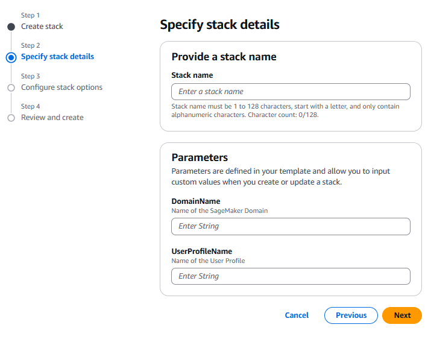
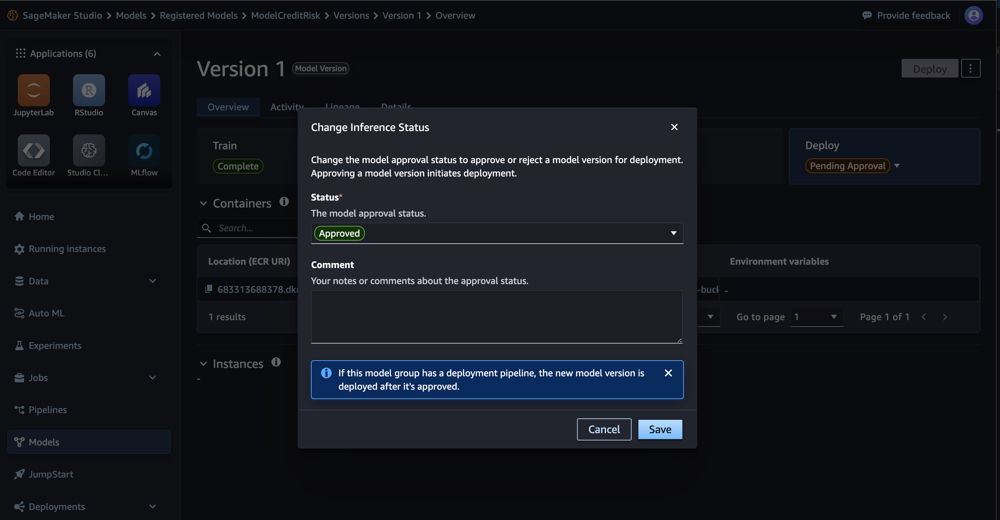

# Use Case and Model Lifecycle Governance with SageMaker Model Registry resource sharing

## Table of Contents

1. [Overview](#overview)
    - [Cost](#cost)
2. [Prerequisites](#prerequisites)
    - [Operating System](#operating-system)
3. [Deployment Steps](#deployment-steps)
4. [Deployment Validation](#deployment-validation)
5. [Running the Guidance](#running-the-guidance)
6. [Next Steps](#next-steps)
7. [Cleanup](#cleanup)
8. [FAQ, known issues, additional considerations, and limitations](#faq-known-issues-additional-considerations-and-limitations-optional)
9. [Authors](#authors)

## Overview 

This guidance demonstrates how to centralize use case and model governance functions in a multi-account environment using the new model group sharing feature of SageMaker model registry. It provides an architecture for setting up central use case/model governance and walks through the steps involved in building that architecture.


The architecture involves the following high-level steps:
1. Create a model package group in a shared services account
2. Share the model package group with development accounts
3. Data scientists experiment and register models in the shared model group
4. Governance officers review and approve models for deployment
5. Models are deployed across test and production accounts
6. Model metrics are tracked centrally for governance purposes

### Cost

You are responsible for the cost of the AWS services used while running this guidance.

We recommend creating a [Budget](https://docs.aws.amazon.com/cost-management/latest/userguide/budgets-managing-costs.html) through [AWS Cost Explorer](https://aws.amazon.com/aws-cost-management/aws-cost-explorer/) to help manage costs. Prices are subject to change. For full details, refer to the pricing webpage for each AWS service used in this guidance.

### Sample Cost Table

| AWS service  | Dimensions | Cost [USD] |
| ------------ | ---------- | ---------- |
| Amazon SageMaker | 1 ml.m5.large instance running 8 hours/day | $91.20/month |
| Amazon S3 | 50 GB storage, 1000 PUT/COPY/POST/LIST requests | $1.25/month |
| AWS Lambda | 1 million invocations, 128 MB memory, 1 sec duration | $0.20/month |

## Prerequisites 
This solution is designed for AWS accounts that are part of the same AWS Organization. It leverages StackSets, which deploy resources from the Hub Account to all spoke accounts. In order to use this guidance, you need the necessary permissions defined in your AWS accounts to enable Stacksets. Additionally, the Model Hub account must be either the organization's management account or the delegated administrator account. Best practice recommends using the delegated administrator account approach.

To set up the required permissions for creating a stack set with self-managed permissions, see [Grant self-managed permissions](https://docs.aws.amazon.com/AWSCloudFormation/latest/UserGuide/stacksets-prereqs-self-managed.html).

To set up the required permissions for creating a stack set with service-managed permissions, see [Activate trusted access for stack sets with Organizations](https://docs.aws.amazon.com/AWSCloudFormation/latest/UserGuide/stacksets-orgs-activate-trusted-access.html).

### Operating System 

This guidance is designed to work on any operating system that supports Python, the AWS CLI, and CDK.

Required packages:
- Python 3.8+
- AWS CLI v2
- AWS CDK
- boto3
- sagemaker

### AWS account requirements &  Assumptions

- All AWS accounts are part of same organisation. 
- You need at least three AWS accounts - one for shared services (also referred to Hub Account in the guidance), one for development and one for testing (also referred as spoke accounts in the guidance)
- Before starting deployment have the below details handy
   - **AWS Account ids of Hub, Development and Test account**
   - **A name for S3 bucket where trained model artifacts will be stored** - this is the input for CFN parameter - HubS3BucketName which will be required across several templates following the steps.
- In order to create a centralized dashbaoard, you need to sign up to [Amazon Quicksight](https://docs.aws.amazon.com/quicksight/latest/user/setting-up.html) using the Hub / Shared services account, and note down the corresponding created user for the associated resource deployment


## Deployment Steps 

### Retrieve the repository

1. Clone the repository:
   ```
   git clone https://github.com/aws-solutions-library-samples/guidance-for-multi-account-machine-learning-model-governance-on-aws.git
   cd guidance-for-multi-account-machine-learning-model-governance-on-aws/
   ```

### Deploy the resources using CloudFormation templates in the shared services / hub account

2. For the next steps, use the cloudformation yaml templates in the [deployment folder](deployment/). All cloudformation templates takes inputs from the user, please be mindful of the names you use to create resources. The templates can be uploaded to Cloudformation using the AWS console. Alternatively you can use the [CLI commands](https://docs.aws.amazon.com/cli/latest/reference/cloudformation/deploy/#examples).

- Go to the shared services / hub AWS account. Upload the file named [step1a-hub-sagemaker-domain-userprofile.yaml](deployment/step1a-hub-sagemaker-domain-userprofile.yaml) 
   - The template takes 2 parameters as input - Sagemaker domain name(any text) and a userprofile name(any text).
   - This creates a Sagemaker domain and a userprofile for using the rest of the guidance. 

   

- Still in the shared services / hub account, upload the file named [step1b-hubaccount-model-package-share.yaml](deployment/step1b-hubaccount-model-package-share.yaml) to Cloudformation in the console. Alternatively you can use the [CLI commands](https://docs.aws.amazon.com/cli/latest/reference/cloudformation/deploy/#examples).
   - The template takes 4 input parameters - a model package group name (stores model versions)(any text), S3 bucket name (stores model artifacts)(any text), development AWS Account Id and test AWS Account Id.
   - We provide a default for the model package group (i.e. `ModelCreditRisk`) for consistency with the provided example notebook to test the guidance, but it can be changed as required.
   - This creates a model package group in the shared services / hub account. This model package group is registered to Resource Access Manager (RAM) as a shared service. An S3 bucket is also created where model artifacts after training in development account will be stored. The S3 bucket has a bucket policy attched allowing cross-account access on it - development and test account's SAGEMAKER_EXECUTION_ROLE is able to write to this S3 bucket.  
   - After the creation of resources, using the AWS console navigate to Resource Access Manager service, and you should now see the model package group created in the last step shared with development and test spoke accounts. 

   

- Finally, remaining in the shared services / hub account, upload the file named [step1c-hubaccount-model-governance-resources.yaml](deployment/step1c-hubaccount-model-governance-resources.yaml) to Cloudformation in the console. Alternatively you can use the [CLI commands](https://docs.aws.amazon.com/cli/latest/reference/cloudformation/deploy/#examples).
   - Create the Amazon QuickSight instance. Please make sure the appropriate permissions are given. 
   - The template takes 10 input parameters:
      - 7 required: **AthenaCatalogName** (the name of the lambda function that will be created to query DynamoDb via Athena), S3 bucket **SpillBucket** (service bucket for Athena queries), **SpillPrefix** (prefix within SpillBucket to spill data from Athena queries),   **DisableSpillEncryption** (if set to `true` the encryption for spilled data is disabled), **LambdaTimeout** ( Lambda invocation runtime in seconds), **LambdaMemory** (Lambda memory in MB),   **QuickSightUserName** (The QuickSight username that to be used to create the Datasources and Datasets, it can be retrieved with the command `aws quicksight list-users --aws-account-id YOUR_AWS_ACCOUNT_ID --namespace default`)
      - 3 optional: **LambdaRole** (a custom, existing IAM role to be used by the Connector Lambda), **KMSKeyId** (use existing KMS Key instead of AES-GCM to encrypt the spilled data by Athena queries), **PermissionsBoundaryARN** (IAM policy ARN to use as the PermissionsBoundary for
      the created Lambda function's execution role)
   - This creates the required DynamoDB tables to capture model package group governance information, approval statuses, as well as Amazon SageMaker endpoint validation metrics, the required EventBridge rules and AWS Lambda functions to orchestrate the data capture and Athena query of DynamoDb tables, and the corresponsing datasources and datasets in Amazon Quicksight ready to be used. All the resources are correlated by IAM policies. 
   - After the creation of resources, navigate to DynamoDB, and you should be able to see the created tables, which will be populated by Model Package approval events as the provided Jupyter Notebook shows, as well as by the metrics collected by Amazon SageMaker endpoint monitoring.

   

### Deploy the resources using CloudFormation templates in the development and test accounts

3. Next steps require to accept shared resource invitations and deploy the appropriate resources, using StackSets from the hub accounts, into the spoke (development and test) accounts.

- First, you need to accept shared resource invitations in Resource Access Manager in the development and test accounts. You can use the AWS console to accept the invitation in Resource Access Manager, or the [CLI commands](https://docs.aws.amazon.com/ram/latest/userguide/working-with-shared-invitations.html).

- Next, use the StackSet from the shared account or go to your **development** account. Upload the file named [step2-dev-spoke-sagemaker-domain-userprofile.yaml](deployment/step2-dev-spoke-sagemaker-domain-userprofile.yaml) in Cloudformation. *Note: This deployment takes about 30 minutes. You can move onto the next step before this deployment completed successfully.*
   - The template takes 6 input parameters (give valid text) - SageMaker domain name (any text), userprofile name (any text), Hub AWS account Id (shared services account), Hub S3 Bucket name (bucket where model artifacts are stored in Hub account), MLflow Server name (any text) and a bucket for MLflow server artifacts.
   - This creates a SageMaker domain, userprofile and a MLflow server in the development account. A SAGEMAKER_EXECUTION_ROLE is also created as part of the stack. This role has permissions to upload model artifacts to Hub account. It also has permissions to access RAM resources shared with this AWS account. Once the resources are created, navigate to IAM roles and search for DevSpokeAccountSagemakerExecutionRole. You will see the custom permissions added to this sagemaker execution role.

   

- Next, use the StackSet from the shared account or go to your **test** account. Upload the file named [step3-test-spoke-sagemaker-domain-userprofile.yaml](deployment/step3-test-spoke-sagemaker-domain-userprofile.yaml) in Cloudformation.
   - The template takes 4 input parameters - SageMaker domain name, userprofile name, Hub AWS account Id (shared services account), Hub S3 Bucket name (bucket where model artifacts are stored in Hub account)
   - This creates a SageMaker domain, userprofile and a SAGEMAKER_EXECUTION_ROLE in the test spoke account. This execution role can read the model artifacts stored in hub account. It also has permissions to access RAM resources shared with this AWS account.Once the resources are created, navigate to IAM roles and search for TestSpokeAccountSagemakerExecutionRole. You will see the custom permissions added to this sagemaker execution role.

   

### Deploy KMS key to be used cross-account

4. Next steps require to deploy CloudFormation templates in all the accounts to write and read the same files on S3 from multiple accounts through a common KMS Key (cfr [this AWS documentation](https://docs.aws.amazon.com/kms/latest/developerguide/key-policy-modifying-external-accounts.html)). The S3 bucket created in the Hub account during step 1b will also have its bucket policy updated allowing the test and development accounts to read and write from and to the bucket. 

- First, go to the **Hub account** and use the template [step4-hubaccount-kms-key-cross-account.yaml](deployment/step4-hubaccount-kms-key-cross-account.yaml) to deploy the KMS key.

- After deploying the KMS key, the SageMaker User Role in the Dev and Test Accounts need to be updated as well. You can use the StackSets from the shared account or go to the respective accounts to deploy the [step5-dev-spoke-kms-key-policy.yaml](deployment/step5-dev-spoke-kms-key-policy.yaml) template in the development account and the [step6-test-spoke-kms-key-policy.yaml](deployment/step6-test-spoke-kms-key-policy.yaml) template in the test account.


### Deployment Validation 

5. Verify that the model package group is created in the shared services account. You can use the Amazon SageMaker console or the AWS CLI command:
   ```
   aws sagemaker describe-model-package-group --model-package-group-name <ModelPackageGroupName-from-step1b>
   ```

6. In the development account, verify that the shared model package group is accessible. Again, you can use the Amazon SageMaker console or the AWS CLI command from the development account itself:
   ```
   aws sagemaker list-model-package-groups --cross-account-filter-option CrossAccount
   ```

7. Verify that the MLflow tracking server is running in the development account. You can use the Amazon SageMaker console or the AWS CLI command from the development account itself:
   ```
   aws sagemaker describe-mlflow-tracking-server --tracking-server-name <MlFlowTrackingServerName-from-step2>
   ```


## Running the Guidance

   #### UCI Machine Learning Repository Data Usage Disclaimer

   The dataset used in the notebook is downloaded from http://archive.ics.uci.edu/ml/datasets/Statlog+%28German+Credit+Data%29;

   Before proceeding with any code execution or data download, please read and acknowledge the following:

   #### Disclaimer

   The following code and any datasets it may download or use adhere to the UCI Machine Learning Repository citation policy. This includes properly citing both the UCI Machine Learning Repository itself and any relevant papers associated with specific datasets. No modification or distribution of UCI datasets is permitted without proper authorization.


1. In the development account, use the [provided example notebook](source/sm-mlflow_model_registry_register_model_shared_model_group.ipynb) in JupyterLab to:
   - Prepare the credit risk dataset
   - Train a model using MLflow for experiment tracking
   - Register the best model to the shared model package group
If you are downloading and uploding the notebook manually, remember to include the [requirements.txt](source/requirements.txt) file as well.

2. The EventBridge rule setup in the Hub account is set to track every `Model package state change`. This can be the variable  `ModelApprovalStatus` visible on the SageMaker UI, but will also track the `StageStatus` variable inside the `ModelLifeCycle`, cfr the documentation about the [model registry staging construct setup](https://docs.aws.amazon.com/sagemaker/latest/dg/model-registry-staging-construct-set-up.html). 
In the shared services account, review and approve the registered model from the Amazon Sagemaker studio model registry (i.e. `ModelApprovalStatus`). It is important to know that the shared model can't be deployed unless is in `Approved` state.

   

   

3. Deploy the shared model, once approved, to the test account using JupyterLab [provided example notebook](source/deploy-shared-model.ipynb).

You will need the following information handy to run the notebook. 1.Hub / Shared Account ID 2.KMS Key id deployed in the Hub account (not the entire Arn) 3. S3 bucket name created in the Hub account (The template HubS3BucketName parameter value)

5. Build an Amazon QuickSight dashboard to monitor model lifecycle statuses in the hub account. You can find an [example Amazon QuickSight dashboard for Model Governance here](assets/quicksight/README.md)


## Next Steps 

- Implement automated model deployment pipelines
- Set up model monitoring in production
- Implement approval workflows for model promotion across stages using the ModelLifecycle [staging construct setup](https://docs.aws.amazon.com/sagemaker/latest/dg/model-registry-staging-construct-set-up.html)
- Monitor model performance and update the central governance table with metrics.

## Cleanup 

1. Delete deployed models and endpoints in test and production accounts
2. Delete the MLflow tracking server in the development account
3. Unshare the model package group:
   ```
   aws ram delete-resource-share --resource-share-arn <RESOURCE_SHARE_ARN>
   ```
4. Delete the model package group in the shared services account
5. Delete any created S3 buckets and IAM roles

## FAQ, known issues, additional considerations, and limitations (optional)

- This guidance creates shared resources across accounts. Ensure proper security measures are in place.
- The model sharing feature requires accounts to be part of the same AWS Organization.
- Consider implementing additional security controls for production model deployments.

For any feedback, questions, or suggestions, please use the issues tab under this repo.

## Authors 


<!---
@TODO - find the approriate locations for these instructions in the content above
------

 In the following we will assume the creation of a StackSet using the CloudFormation console and Service Managed permissions. You can find a more comprehensive list of commands using [AWS CLI in this README](assets/stacksets/README.md).
------
-->
